## Olá! 👋🏻 Aqui é Daniel Ribeiro e seja bem vindo ao meu GitHub 😊

## Sobre mim:


```js
import Desenvolvedor from "dielito2010";

class SobreMim extends Desenvolvedor {
  nome = "Daniel Ribeiro";
  area = "P&D - Software";
  trabalho = "DAR Empreendimentos";
  local = "Belo Horizonte - MG";
}

class Atuacao extends Desenvolvedor {
  desenvolvimento = ["FullStack", "Backend", "Frontend", "Mobile"];
}
```

<details>
  
<summary><small>Carreira:</small></summary>

👨🏻‍🏫 Atualmente, busco atuar como Dev, mas minha jornada até aqui é interessante, vamos em ordem cronológica. Meu primeiro contato com um computador ocorreu aos 12 anos, por volta de 2000. Mesmo sem ter feito nenhum curso formal, rapidamente me familiarizei com a usabilidade. Percebi meu talento quando as pessoas começaram a me procurar para ajudá-las com tarefas relacionadas a computadores. Nessa época, eu "brincava" com MS-DOS, Windows 95 e Windows 98.

Minha carreira em tecnologia da informação começou em 2008 como técnico de manutenção de hardware. Posteriormente, trabalhei como designer gráfico, principalmente usando o CorelDRAW e o Photoshop ferramentas que estavam em seu auge, hoje em dia as ferramentas evoluíram, eu uso o Figma e, ocasionalmente, Canva.

Em 2012, com minha bagagem de conhecimento em informática, fui convidado para ser instrutor. Não apenas ministrei aulas, mas também tive a responsabilidade de criar e formatar materiais didáticos semelhantes a apostilas, cobrindo todo o conteúdo do curso dividido em 5 módulos para os 5 primeiros anos do ensino fundamental. Essa fase interessante durou 3 anos e trabalhei nesse formato em 2 escolas.

Em 2015, recebi um convite para fazer parte de uma representante local de um sistema de PDV nacional, com foco em bares e restaurantes. O sistema era baseado em desktop e desenvolvido em C#. Minha principal responsabilidade envolvia a implantação, inserção inicial de dados e manutenção do sistema. Foi nesse momento que percebi a importância do conhecimento em SQL, já que precisava manipular dados de forma eficiente. Aprender SQL foi um passo crucial para minha jornada, pois me permitiu lidar com informações de forma mais eficaz e me introduziu ao universo dos softwares. Minha paixão por essa área me levou a me tornar um representante local oficial do sistema MarketUP, oferecendo serviços para microempresas do varejo na região de Manaus. Isso ampliou minha experiência e meu envolvimento com o setor de software.

Em 2017, decidi transferir minha carteira de clientes para um parceiro quando fui inserido em uma fábrica de maquininhas de cartão. Inicialmente, comecei a trabalhar na produção, mas logo fui transferido para o time de sistemas. O produto principal era um sistema ERP, desenvolvido em Delphi, com um banco de dados Oracle e gerenciamento de código-fonte no Git. Comecei minha jornada nesse ambiente como suporte técnico, ajudando a resolver problemas dos usuários. Com o passar do tempo, fui convidado a desempenhar um papel mais proativo e me tornei analista, focando nos módulos de estoque, produção, engenharia e qualidade. A empresa passou por mudanças significativas em 2018, tornando-se parte de um grupo maior, e em 2019 iniciamos os trabalhos para a implantação do sistema SAP B1. Continuar a trabalhar nessa área foi uma experiência enriquecedora para mim, e minha jornada nesse ambiente durou até 2020.

A partir de 2021, tomei a decisão de criar uma MEI e utilizei toda a experiência que adquiri para me dedicar exclusivamente ao desenvolvimento de código-fonte. Até o presente momento, minha trajetória tem se concentrado principalmente no desenvolvimento web e mobile. Mais a baixo, você pode verificar as tecnologias com as quais estou familiarizado.


🧑🏻‍💻 Iniciei a faculdade de Análise e Desenvolvimento de Sistemas em 2015, porém, ao longo do caminho, enfrentei alguns desafios que me levaram a trancar a matrícula 2 vezes. A primeira vez foi devido a dificuldades financeiras, e a segunda devido à incompatibilidade de horários com o meu trabalho. Como resultado, um curso que originalmente deveria ser concluído em 3 anos acabou levando 5 anos para ser finalizado. Essas são situações que podem ocorrer ao longo da carreira acadêmica, e finalmente, consegui concluir meu curso no primeiro semestre de 2020.

</details>

## Tecnologias:

<table>

<tr>
<td align="center" width="50%" valign="top">

### Frontend:


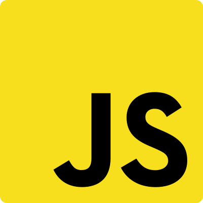


</td>
<td align="center" valign="top">

### Mobile:


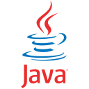

</td>
</tr>

<tr>
<td align="center" valign="top">

### Backend:


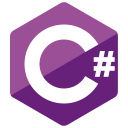

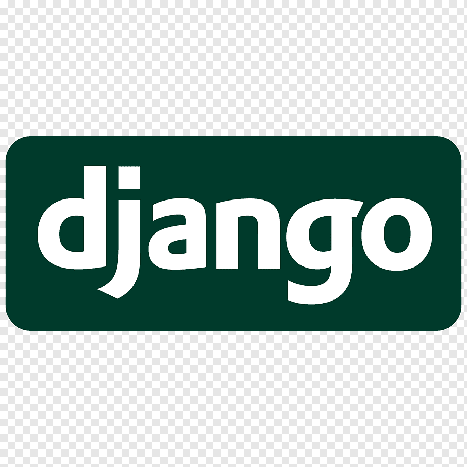


</td>
<td align="center" valign="top">

### Banco de Dados:

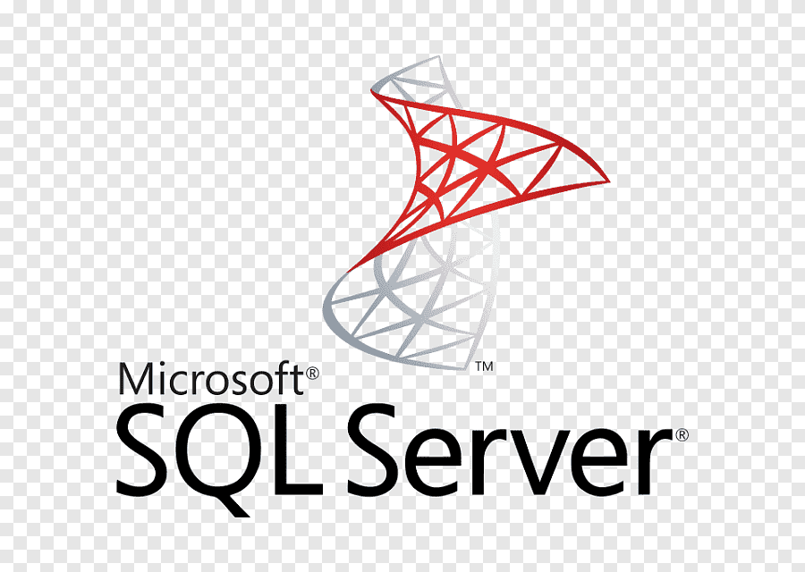
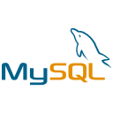


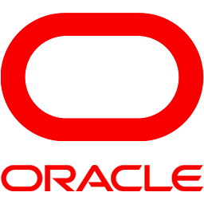

</td>
</tr>

<tr>
<td align="center" valign="top">

### Metodologias e testes:

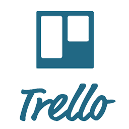


</td>
<td align="center" valign="top">

### Computação em nuvem:


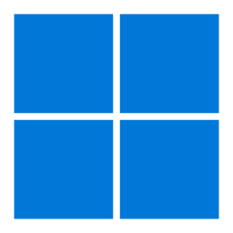


</td>
</tr>

<tr>

<td align="center" valign="top">

### Tools e IDEs:


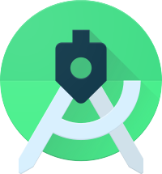
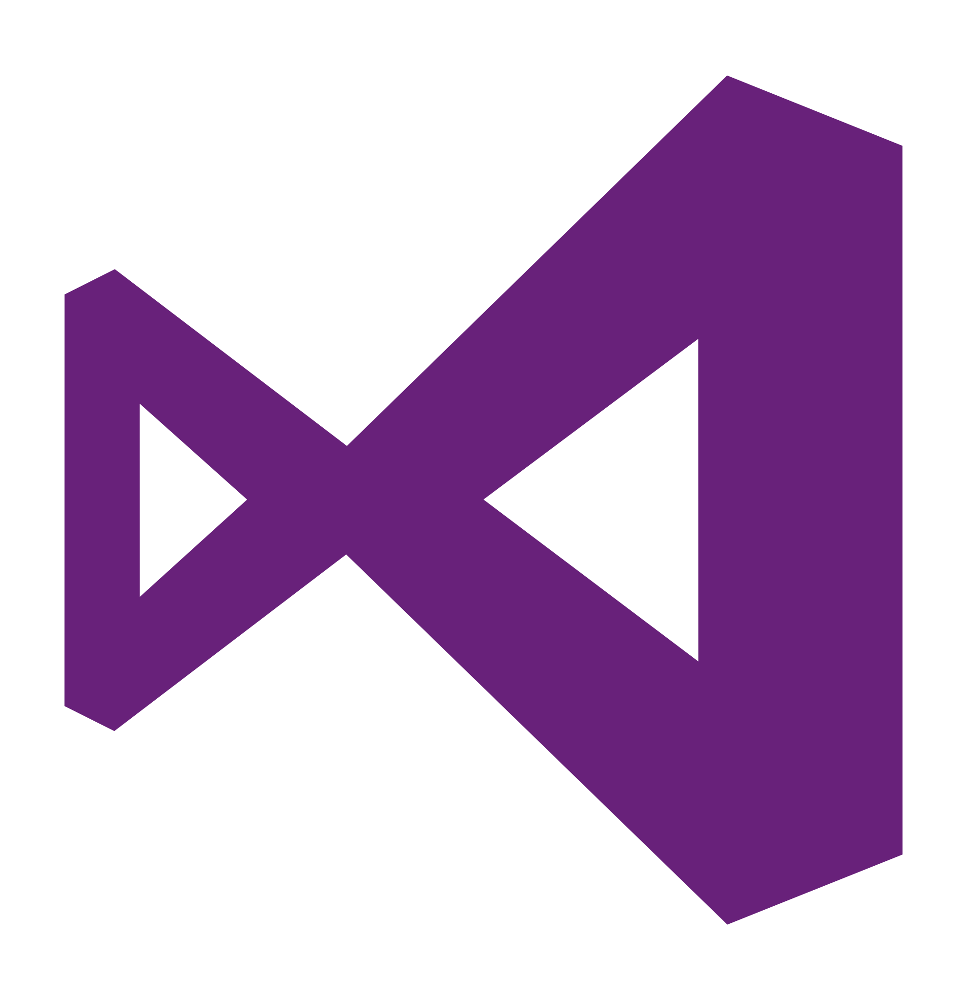

</td>
<td align="center" valign="top">

### Iniciante em:


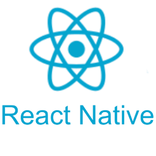


### Está no radar para iniciar:

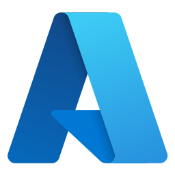

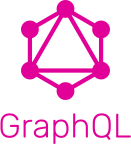


</td>
</tr>

</table>
<br>
<br>
<br>

## Estatísticas do GitHub:

<div align="center">
    <br>
    
</div>
<br>
<br>
<br>

## Contate-me:

<div align="center">
  <a href="https://github.com/dielito2010" target="_blank">
    
  </a>
  <a href="https://linkedin.com/in/daniel-antunes-ribeiro" target="_blank">
    
  </a>
  <a href="mailto:d.a.ribeiro2@gmail.com" target="_blank">
    
  </a>
  <a href="https://danielribeiro.dev.br" target="_blank">
    
  </a>
</div>
