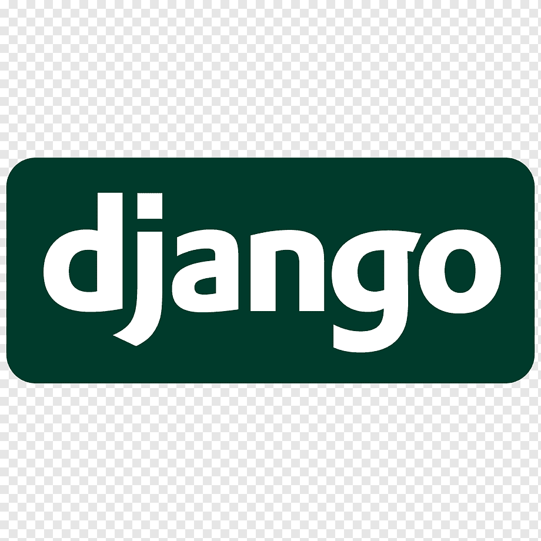
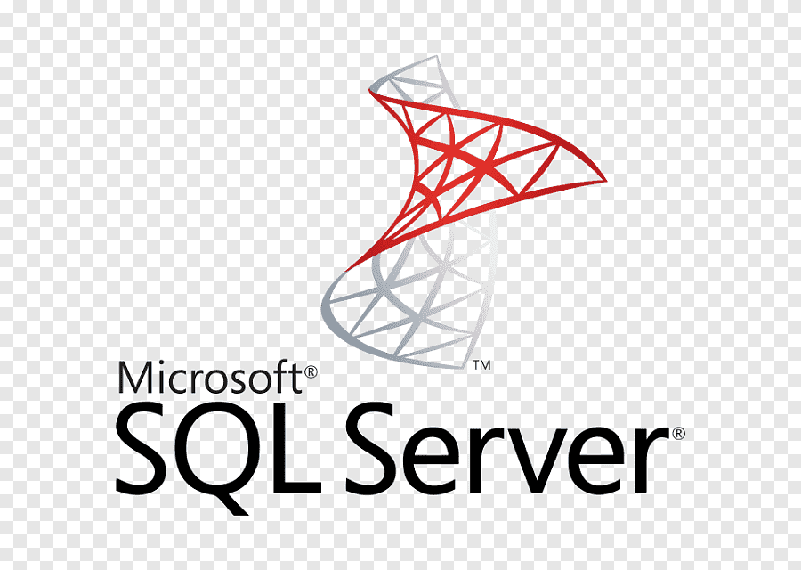
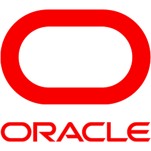
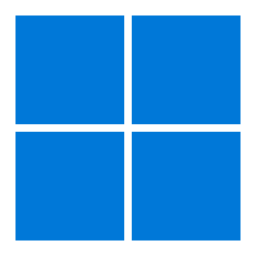

## Olá! 👋🏻 Aqui é Daniel Ribeiro e seja bem vindo ao meu GitHub 😊

## Sobre mim:


```js
import Desenvolvedor from "dielito2010";

class SobreMim extends Desenvolvedor {
  nome = "Daniel Ribeiro";
  area = "Software Engineer";
  trabalho = "DAR Empreendimentos";
  local = "Manaus";
}

class Atuacao extends Desenvolvedor {
  desenvolvimento = ["FullStack", "Backend", "Frontend", "Mobile"];
}
```

<details>
  
<summary><small>Carreira:</small></summary>

👨🏻‍🏫 Atualmente, busco atuar como Dev, mas minha jornada até aqui é interessante, vamos em ordem cronológica. Meu primeiro contato com um computador ocorreu aos 12 anos, por volta de 2000. Mesmo sem ter feito nenhum curso formal, rapidamente me familiarizei com a usabilidade. Percebi meu talento quando as pessoas começaram a me procurar para ajudá-las com tarefas relacionadas a computadores. Nessa época, eu "brincava" com MS-DOS, Windows 95 e Windows 98.

Minha carreira em tecnologia da informação começou em 2008 como técnico de manutenção de hardware. Posteriormente, trabalhei como designer gráfico, principalmente usando o CorelDRAW e o Photoshop ferramentas que estavam em seu auge, hoje em dia as ferramentas evoluíram, eu uso o Figma e, ocasionalmente, Canva.

Em 2012, com minha bagagem de conhecimento em informática, fui convidado para ser instrutor. Não apenas ministrei aulas, mas também tive a responsabilidade de criar e formatar materiais didáticos semelhantes a apostilas, cobrindo todo o conteúdo do curso dividido em 5 módulos para os 5 primeiros anos do ensino fundamental. Essa fase interessante durou 3 anos e trabalhei nesse formato em 2 escolas.

Em 2015, fui convidado para trabalhar em uma representante local de um sistema de PDV nacional voltado para bares e restaurantes. O sistema era baseado em desktop, desenvolvido em C#. Eu não tive acesso ao código-fonte, pois minha função era principalmente implantação e inserção inicial de dados no sistema. Foi nesse momento que decidi aprender SQL para facilitar o processo, já que os dados dos produtos eram os mesmos. Criei um script padrão e, com isso, reduzimos significativamente o tempo de implantação. Embora tenha sido uma breve experiência, foi importante, pois me introduziu no mundo dos sistemas.

Eu estava tão envolvido com essa área que decidi me tornar o representante local oficial do sistema MarketUP. Em 2017, decidi transferir minha carteira de clientes para um parceiro quando fui inserido em uma fábrica de maquininhas de cartão. Inicialmente, comecei a trabalhar na produção, mas logo fui transferido para o time de sistemas. O produto principal era um sistema ERP, desenvolvido em Delphi, com um banco de dados Oracle e gerenciamento de código-fonte no Git. Comecei minha jornada nesse ambiente como suporte técnico, ajudando a resolver problemas dos usuários. Com o passar do tempo, fui convidado a desempenhar um papel mais proativo e me tornei analista, focando nos módulos de estoque, produção, engenharia e qualidade. A empresa passou por mudanças significativas em 2018, tornando-se parte de um grupo maior, e em 2019 iniciamos os trabalhos para a implantação do sistema SAP B1. Continuar a trabalhar nessa área foi uma experiência enriquecedora para mim, e minha jornada nesse ambiente durou até 2020.

A partir de 2021, tomei a decisão de criar uma MEI e utilizei toda a experiência que adquiri para me dedicar exclusivamente ao desenvolvimento de código-fonte. Até o presente momento, minha trajetória tem se concentrado principalmente no desenvolvimento web e mobile. Mais a baixo, você pode verificar as tecnologias com as quais estou familiarizado.

🧑🏻‍💻 Iniciei a faculdade de Análise e Desenvolvimento de Sistemas em 2015, porém, ao longo do caminho, enfrentei alguns desafios que me levaram a trancar a matrícula 2 vezes. A primeira vez foi devido a dificuldades financeiras, e a segunda devido à incompatibilidade de horários com o meu trabalho. Como resultado, um curso que originalmente deveria ser concluído em 3 anos acabou levando 5 anos para ser finalizado. Essas são situações que podem ocorrer ao longo da carreira acadêmica, e finalmente, consegui concluir meu curso no primeiro semestre de 2020.

</details>

## Tecnologias:

<table>

<tr>
<td align="center" width="50%" valign="top">

### Frontend:


</td>
<td align="center" valign="top">

### Mobile:


</td>
</tr>

<tr>
<td align="center" valign="top">

### Backend:





</td>
<td align="center" valign="top">

### Database:






</td>
</tr>

<tr>
<td align="center" valign="top">

### Metodologias e testes:


</td>
<td align="center" valign="top">

### Computação em nuvem:





</td>
</tr>

<tr>

<td align="center" valign="top">

### Tools e IDEs:


</td>
<td align="center" valign="top">

### Iniciate em:


### Está no radar para iniciar:


</td>
</tr>

</table>
<br>
<br>
<br>

## Estatísticas do GitHub:

<div align="center">
    <br>
    <br>
    
</div>
<br>
<br>
<br>

## Contate-me:

<div align="center">
  <a href="https://github.com/dielito2010" target="_blank">
    
  </a>
  <a href="https://linkedin.com/in/daniel-antunes-ribeiro" target="_blank">
    
  </a>
  <a href="mailto:d.a.ribeiro2@gmail.com" target="_blank">
    
  </a>
  <a href="https://danielribeiro.dev.br" target="_blank">
    
  </a>
</div>
